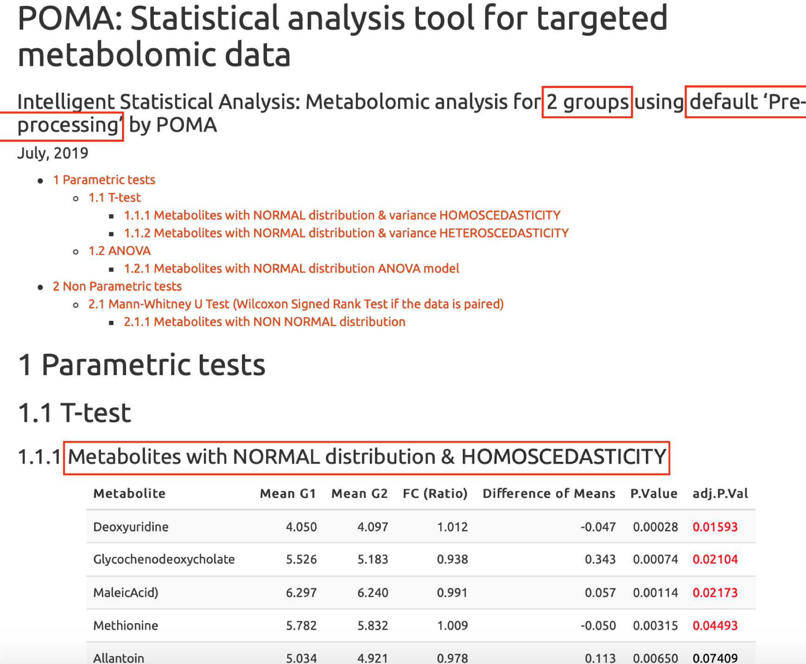

# Outline

.pull-left[

### 1. Context
### 2. Motivation & Aims
### 3. Results
### 4. Conclusions
### 5. Future Work

]

.pull-right[

.center[

]

]

---

class: inverse, center, middle
<html><div style='float:left'></div><hr color='#f38620' size=1px width=720px></html> 

# CONTEXT

---

# What’s Metabolomics?

_"Metabolomics is the identification and quantification of the small molecule metabolic products (the metabolome) of a biological system. Mass spectrometry and NMR spectroscopy are the techniques most often used for metabolome profiling"<sup>1</sup>_

## _"The Omics Cascade"_

.center[
<sup>2</sup>
]

.footnote[
[1] https://www.nature.com/subjects/metabolomics

[2] Narad P., Kirthanashri S.V. (2018) Introduction to Omics. In: Arivaradarajan P., Misra G. (eds) Omics Approaches, Technologies And Applications. Springer, Singapore
]

---

# The data

## Targeted and untargeted metabolomics

.center[


]

  - **Targeted metabolomics:** we know the mass of the metabolites that we want to quantify BEFORE the analysis (hundreds)

  - **Untargeted metabolomics:** all metabolites will be acquired, but we will not know exactly which ones are some of them (thousands)

## How is the data that we will analize?

  - Standard (Omics) matrix: Samples in rows and metabolites (variables) in columns
  
---

# Freely Available Existing Tools

.pull-left[

```{r, warning = FALSE, comment = NA, message = FALSE, echo = FALSE, dpi = 200}
library(ggplot2)
tools <- readxl::read_excel("tools.xlsx")
#png("pix/tools.png", res = 200, units = "cm", width = 20, height = 20)
ggplot(tools, aes(`Tool class`, ..count..)) +
  geom_bar(aes(fill = `Software type`), position = "dodge") +
  xlab("") +
  ylab("Counts") +
  theme_minimal() +
  theme(
    legend.title=element_text(size=14),
    legend.text=element_text(size=13),
    axis.text=element_text(size=14),
    axis.title=element_text(size=14))
#dev.off()
```

]

.pull-right[

### Web Apps that allows users to perform a statistical analysis<sup>3</sup>

  - Workflow4metabolomics 
  - Galaxy-M
  - XCMS Online 
  - MetaboAnalyst
]

.footnote[

[3] Spicer, R., Salek, R. M., Moreno, P., Cañueto, D., & Steinbeck, C. (2017). Navigating freely-available software tools for metabolomics analysis. Metabolomics, 13(9), 106.

]

---

class: inverse, center, middle
<html><div style='float:left'></div><hr color='#f38620' size=1px width=720px></html> 

# MOTIVATION & AIMS

---

# Motivation & Aims

## Motivation

  - Biological interpretation of the results is one of the hard points and high knowledge of statistical analysis and computational programming is usually required
  
  - Sometimes, the existing tools don’t accept "complicated" databases

## Aims

  - Provide users of an <span style="color:#f38620">**EASY USE**</span> tool that don’t require programming skills
  
  - Allow users to analyze all types of data (simple and complex)
  
  - Lead the user for a good statistical analysis (Documentation & automatic reports) 
  
  - Make a completely <span style="color:#f38620">**REPRODUCIBLE**</span> analysis (Open Source)
  
  - **Our main aim is <span style="color:#f38620">COMPLETING</span> the existing tools and give other option to users, <span style="color:#f38620">NOT</span> to <span style="color:#f38620">COMPETE</span> with the existing tools**


???

Because we want
Because programming is cool
Black box

---

class: inverse, center, middle
<html><div style='float:left'></div><hr color='#f38620' size=1px width=720px></html> 

# RESULTS

---

# POMA Shiny App


_http://polcastellano.shinyapps.io/POMA/_

---

# Architecture


---

# Input Data Panel

We have used the `shinydashboard` package for the main structure and the `dashboardthemes` package for customization


---

# Input Data Panel

We have used the `shinydashboard` package for the main structure and the `dashboardthemes` package for customization


---

# Visualization

All plots in the app are designed using `plotly` package. It make all plots interactive allowing users to zoom in or zoom out in a plots, select points to see the individual information, hide all points of one group and download plots in a easy way!

.pull-left[


]

.pull-right[


]

---

# Documentation

The implementation of `shinyhelper` package allows each panel to have an individual help  


---

# Documentation

The implementation of `shinyhelper` package allows each panel to have an individual help  


---

# Statistical Analysis

The aim is to offer to tune as many parameters as possible to avoid the "black box" effect


---

# Automatic Statistical Report

.center[

]

---

class: inverse, center, middle
<html><div style='float:left'></div><hr color='#f38620' size=1px width=720px></html> 

# CONCLUSIONS

---

# Conclusions

<b>

  - We have developed a <span style="color:#f38620">FAST</span>, <span style="color:#f38620">FRIENDLY</span> and <span style="color:#f38620">FREE</span> software that is called POMA
  
  - POMA is <span style="color:#f38620">full-based in R</span> language and uses a <span style="color:#f38620">Shiny</span> system to run
  
  - POMA provides an accurate <span style="color:#f38620">DOCUMENTATION</span> ("HELP") at each step of analysis that coluld improve the results and facilitate the interpretation of it
  
  - POMA can generate two types of <span style="color:#f38620">AUTOMATIC REPORTS</span>: Exploratory report and Statistical report
  
  - POMA is in a constant development. According to this, we are <span style="color:#f38620">totally open to user</span> bug reports to keep improving our app

</b>

---

# Future Work

(In order of importance...)

  - Finishing the **documentation** as accurately as possible
    
  - Make the code more **efficient**

  - Develop a **package** with all POMA functions

.center[


]

---

class: inverse, center, middle

# Thank you all!

To the [Statistics and Bioinformatics Research Group](https://sites.google.com/view/estbioinfo/home) and [Biomarkers and Nutritional & Food Metabolomics Research Group](http://www.nutrimetabolomics.com/) from [University of Barcelona](https://www.ub.edu/web/ub/en/index.html?) for amazing support

To the [useR! 2019](http://www.user2019.fr/) organizers, for allowing me to show this work

Slides created via the R package [xaringan](https://github.com/yihui/xaringan)

<html><div style='float:left'></div><hr color='#f38620' size=1px width=720px></html> 

<a href="mailto:polcaes@gmail.com"><i class="fas fa-envelope"></i>&nbsp; polcaes@gmail.com</a><br>
<a href="https://pcastellanoescuder.github.io/"><i class="fas fa-link"></i>&nbsp; pcastellanoescuder.github.io/</a><br>
<a href="http://twitter.com/polcastellano_"><i class="fab fa-twitter"></i>&nbsp; @polcastellano_</a><br>
<a href="https://github.com/pcastellanoescuder"><i class="fab fa-github"></i>&nbsp; @pcastellanoescuder</a><br>
<a href="https://www.ub.edu/web/ub/en/index.html?"><i class="fas fa-map-marker-alt"></i>&nbsp; University of Barcelona</a>

```{r, warning = FALSE, comment = NA, message = FALSE, echo = FALSE, eval = FALSE}
# HTML to PDF
library(webshot)
file_name <- paste0("file://", normalizePath("poma_slides_useR2019.html"))
webshot(file_name, "poma_slides_useR2019.pdf")
```

